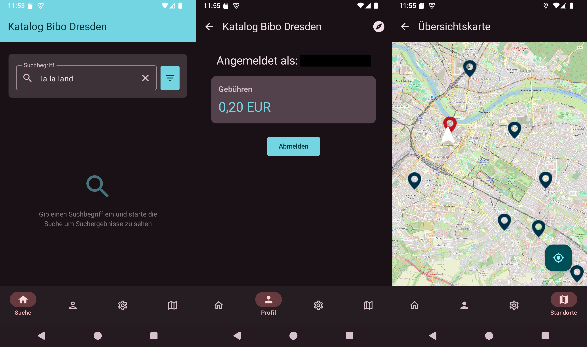

# Beebo
This is an unofficial **Android only** app  for accessing the online catalogue of Dresden City Library.
As the [current website](https://katalog.bibo-dresden.de/) does not offer a pleasant mobile experience, and there is no app that covers the full functionality of the site, this app aims to improve the user experience for mobile users.

## Features
- Search in the online catalog
- Filter by release date, availability date, media type, and branch office
- Allow to log in to your library account and see the current fees
- See all available library branches in an overview map
- Uses Material3 colors (which means you can change the Apps Colors based on your background settings)

## Installation
Either build this app yourself in AndroidStudio or install in the [play store](https://play.google.com/store/apps/details?id=com.fm.beebo).

## Disclaimer
As there are no official endpoints for the online catalogue, this app connects to the website and extracts the necessary information.